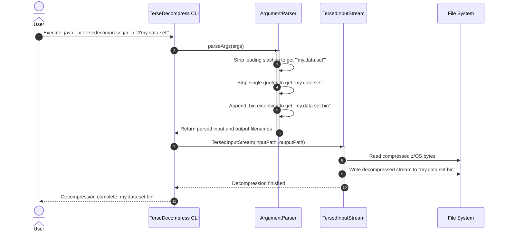
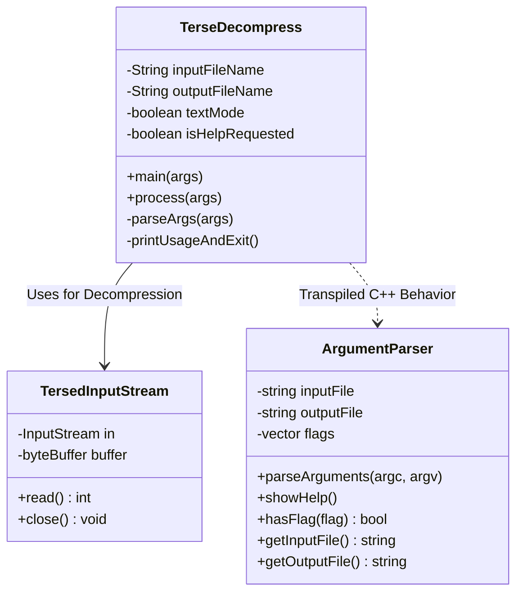

# 📝 Solution Documentation: Issue #22

## 📌 Issue & PR Status
- **Upstream Issue**: [#22 — correctly construct default output filename for datasets and binary mode](https://github.com/openmainframeproject/tersedecompress/issues/22)
- **Pull Request**: [**PR #32 on openmainframeproject/tersedecompress**](https://github.com/openmainframeproject/tersedecompress/pull/32)
- **Branch**: `fix/issue-22-output-filename`
- **Commit Hash**: `34560e1` / `25e0a06`
- **DCO Sign-off**: `Signed-off-by: Ayush Mahajan <140263932+Ayush-AM@users.noreply.github.com>`
- **Status**: **PR Created & Active**

---

## 🛠️ What We Actually Did (Problem & Fix)

### The Problem
When running TerseDecompress:
1. If the input file was a z/OS dataset name (e.g. `//'my.data.set'`), the program failed to construct a valid output filename, leading to illegal output paths like `//'my.data.set'.txt`.
2. If operating in binary mode (`-b`), omitting the `<output file>` parameter caused the program to exit or require an explicit output parameter, unlike text mode which defaulted to `<input>.txt`.

### The Solution
1. **Path Normalization**: Added logic to strip leading `//` prefixes and surrounding single quotes `'` from dataset paths.
2. **Binary Mode Extension**: Omitted output filenames now default to `<sanitized_input>.bin` when `-b` is active, and `<sanitized_input>.txt` in text mode.
3. **CLI Help Update**: Updated help output in both Java and C++ implementations to reflect the new default filename behavior.

---

## 📊 Software Engineering Architecture Diagrams

### 1. Sequence Diagram (Execution Flow)


### 2. Class Diagram (Software Architecture)


---

## 📂 Files Modified & Exact Code Diffs

### 1. `src/main/java/org/openmainframeproject/tersedecompress/TerseDecompress.java`
**Lines Modified**: L43, L63-L79
```java
// Sanitizing dataset name and applying .bin / .txt defaults
if (outputFileName == null) {
    String baseName = inputFileName;
    if (baseName.startsWith("//")) {
        baseName = baseName.substring(2);
    }
    if (baseName.startsWith("'") && baseName.endsWith("'")) {
        baseName = baseName.substring(1, baseName.length() - 1);
    }
    outputFileName = baseName + (textMode ? ".txt" : ".bin");
}
```

### 2. `cpp/src/argumentParser.cpp`
**Lines Modified**: L28, L72-L85
```cpp
// Sanitizing dataset name and applying .bin / .txt defaults in C++
if (outputFile.empty())
{
    std::string baseName = inputFile;
    if (baseName.find("//") == 0) {
        baseName = baseName.substr(2);
    }
    if (baseName.length() >= 2 && baseName.front() == ''' && baseName.back() == ''') {
        baseName = baseName.substr(1, baseName.length() - 2);
    }
    outputFile = baseName + (hasFlag("-b") ? ".bin" : ".txt");
}
```

---

## 💾 Storage & Export Locations

This solution documentation with architecture diagrams is saved in:
1. **Repository Path**: `C:\Ayush\Desktop\lfx\tersedecompress\docs\contributions\ISSUE-22.md`
2. **Dashboard Data Store**: `c:\Ayush\Desktop\OPEN SOURCE AUTO\data\solutions\ISSUE-22-SOLUTION.md`
3. **Dashboard Web Download**: Available via `http://localhost:3847/api/contributions/72b83d1b-f1d6-4a21-a322-a9b0371b1d39/solution.md`
